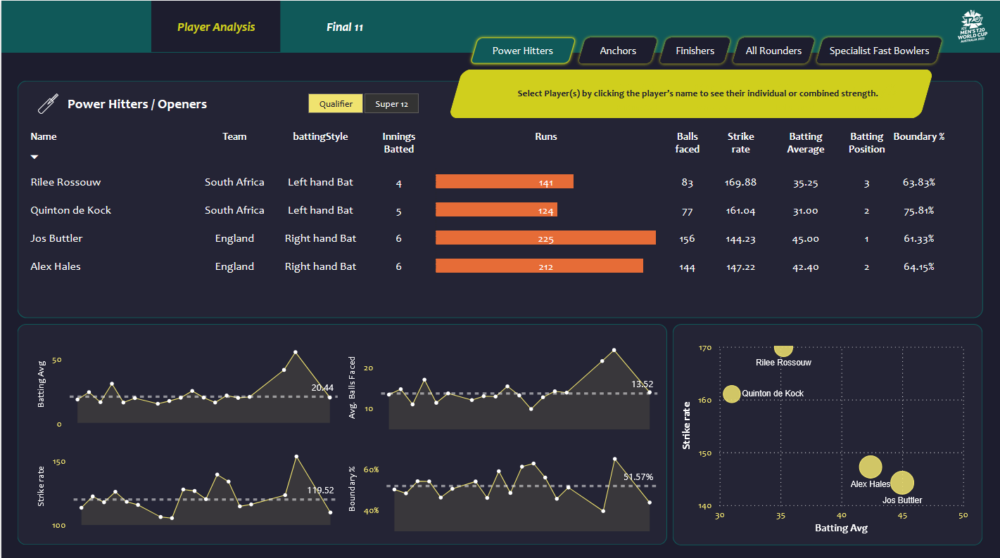

# 🏏 Top 11 Cricket Players Selection - Data Analytics Project

This project focuses on building a data-driven model and visualization tool to select the best 11 international cricket players using performance metrics based on the ICC T20 World Cup standards.

## 📌 Objective
Select the best 11 players from around the globe ensuring:
- The team can **score 180+ runs** on average
- The team can **defend 150+ runs** efficiently

## 📁 Data & Parameters
Criteria were extracted from the official *Parameter Scoping* document, with role-based filters:

### ⚡ Power Hitters / Openers
- Batting Average > 30
- Strike Rate > 140
- Boundary % > 50%
- Batting Position < 4

### 🧱 Anchors / Middle Order
- Batting Average > 40
- Strike Rate > 125
- Avg. Balls Faced > 20
- Batting Position > 2

### 🔥 Finishers
- Batting Average > 25
- Strike Rate > 130
- Avg. Balls Faced > 12
- Batting Position > 4

### 🛡️ All-Rounders
- Batting Average > 15, SR > 140, Bowling Eco < 7, SR < 20

### 💣 Specialist Fast Bowlers
- Economy < 7, Bowling Average < 20, Dot Ball % > 40%

## 🛠️ Tools Used
- **Python (Pandas)** – Data preprocessing, filtering, and analysis
- **Power BI** – Interactive dashboard development

## 📈 Dashboard Highlights
- Role-based filtering tabs (Openers, Anchors, etc.)
- Interactive visualizations: strike rate vs. average, trend lines, boundary %
- Selection logic applied dynamically on dataset

## 📸 Preview

## 🔗 Connect With Me
Feel free to connect and explore more:
- [LinkedIn](https://www.linkedin.com/in/YOURUSERNAME)
- [GitHub](https://github.com/YOURUSERNAME)
